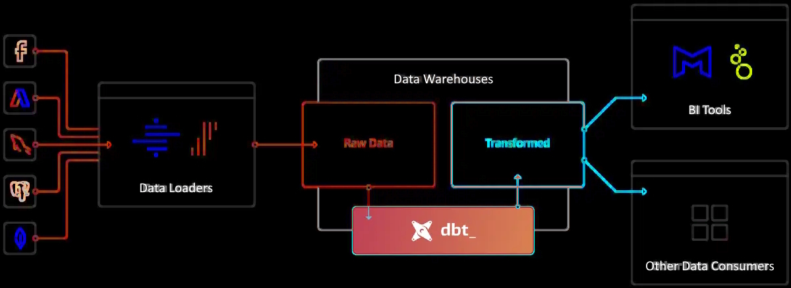

# **dbt** (data build tool)

**[⇐ Data Engineering Fundamentals](./README.md)**

* [Setting up **dbt** with **Snowflake**](./Setting%20Up%20dbt%20with%20Snowflake.md)

## What is **dbt**
dbt is a command-line tool and framework that enables data analysts and engineers to transform raw data in their data warehouse into clean, well-organized, and documented datasets using SQL and Python. It follows software engineering best practices including version control, testing, and documentation to support the modern data stack.

In ELT (Extract, Load, Transform) dbt is the T (Transform). It doesn't extract or load data, but it's extremely good at transforming data that's already loaded into a warehouse. This "transform after load" architecture is becoming known as ELT (extract, load, transform).

**dbt is both a compiler and an orchestrator of SQL transformations.**  
At its core, dbt takes the SQL and Jinja templates that users write in their project and compiles them into executable SQL statements tailored to the target data warehouse. Once compiled, dbt’s runner executes these statements in the correct dependency order, building models, views, and tables inside the warehouse.

Users develop their models in standard files within a dbt project, then invoke dbt from the command line (or via dbt Cloud). dbt resolves references, applies macros, builds the dependency graph, compiles everything into raw SQL, and then issues those SQL commands directly to the configured warehouse engine (e.g., Snowflake, BigQuery, Redshift, Postgres).

**dbt and the modern BI stack**
dbt fits nicely into the modern BI stack, coupling with products like Stitch, Fivetran, Redshift, Snowflake, BigQuery, Looker, and Mode.

### Some of the major benefits of dbt

* **Flexibility** - dbt supports multiple popular databases such as Google BigQuery, Snowflake, Redshift, and PostgreSQL. This flexibility makes it versatile across multiple environments and projects.

* **Real-time Monitoring** - With real-time monitoring and alert features, dbt helps maintain the health of data pipelines by enabling prompt resolutions of issues.

* **Scalability:** - dbt has a distributed execution model, helping it utilize computing resources efficiently. This allows it to scale up or down instantly based on demand and effectively manage large datasets and complex workflows.

## **dbt in Data Engineering?**

Some of the major reasons for utilizing dbt in data engineering and analytics are mentioned below.

- **Data Transformation Engine:** dbt serves as a powerful engine for transforming raw data into structured data formats for enhanced analysis. This allows data engineers full control over transformations by defining complex SQL-based logic directly within the data warehouse.

- **Performance Optimization:** dbt enhances efficiency by supporting incremental builds. This enables it to process only the recent changes to data made after the last successful run, thereby minimizing computing resource usage and reducing processing times.

- **Automated Testing:** dbt offers built-in support for automated data testing. This helps ensure data transformations produce quality and accurate outputs, helping maintain data integrity.

- **Data Warehouse Support:** dbt enables you to effortlessly integrate, manage, and analyze your massive data in a centralized location. Its ability to work with multiple data warehouses, such as BigQuery, Redshift, and Snowflake, makes it a preferred solution for data engineers.

- **Continuous Integration and Deployment:** dbt seamlessly integrates with CI/CD pipelines, deployment tools, and version control systems. This enables data engineering teams to automate testing and data pipeline deployments.

### **The Key Concepts and Terminologies in dbt**

* **Data object**: any entity that can be queried or manipulated within your data platform. This includes tables, views, and other database objects that store and organize data.

* **Table**: a structured set of data held in a database, consisting of rows and columns. Each column represents a different attribute of the data, and each row corresponds to a single record. Tables are fundamental components in databases and are used to store and organize data efficiently.

* **View**: a database object that stores a SQL query rather than the data itself. When you query a view, the database runs the stored SQL query and returns the results.

- **Models:** dbt arranges data transformations into logical units known as models. These are SQL queries that transform raw data into tables or views, forming the backbone of dbt data pipelines.

- **Sources:** dbt sources are a way of declaring tables of the raw datasets collected from multiple data sources, such as files, databases, or any third-party applications.

- **Snapshots:** dbt offers incremental tables known as snapshots to capture and store historical changes in the source data over time. This is particularly useful for tracking slowly changing dimensions.

- **Seeds:** Seeds are dbt models representing static data, typically from CSV files. They are used for data that does not change frequently, such as dimension tables or lookup tables.

- **Profiles:** In dbt, profiles incorporate database connection configurations, managed in a profiles.yml file, which specify how dbt connects to your data warehouse.

- **Packages:** dbt packages are reusable components such as hooks, macros, and models. These extend the functionality of dbt and optimize data transformation workflows.

- **Tests:** In dbt, tests are assertions that check the quality of transformations to prevent data errors. There are multiple types of tests in dbt, such as data tests, schema tests, and user-defined tests for custom validations.

- **Documentation:** This is the automatically generated data from dbt metadata. It provides you with valuable insights into the structure and logic of the data pipelines.

- **Projects:** In dbt, projects comprise all the components of a dbt workflow. This includes models, tests, configuration data, and all the relevant information for a specific data transformation. They manage all the data transformation workflows by creating a structured environment.

---

...........

### Key Features
- **Modular SQL transformations** - Organize transformations into reusable, testable units
- **Version control** - Manage data pipeline code like application code
- **Testing & documentation** - Built-in testing framework and auto-generated documentation
- **Dependency management** - Automatically handles transformation dependencies
- **Multiple adapters** - Supports various data warehouses (Snowflake, BigQuery, Redshift, etc.)
Documentation on Data Build Tool
---

### Core Components of dbt

1. Models
    - SQL files that define transformations.
    - Each model becomes a table or view in your warehouse.
    - Organized using `SELECT` statements.
    - Supports **ref()** to build dependency graphs.

2. Sources
    - Definitions of raw data tables in your warehouse.
    - Helps track lineage from raw → transformed.
    - Enables freshness checks.

3. Tests
    - Built‑in tests: `unique`, `not_null`, `accepted_values`, `relationships`.
    - Custom tests using SQL.
    - Ensures data quality at every transformation step.

4. Seeds
    - CSV files stored in your dbt project.
    - Loaded into the warehouse as tables.
    - Useful for reference data (e.g., country codes).

5. Snapshots
    - Tracks slowly changing dimensions (SCD Type 2).
    - Captures historical changes in source tables.

6. Macros
    - Jinja-powered reusable SQL logic.
    - Helps reduce duplication.
- Can create custom materializations, tests, or utilities.

---

### **7. Documentation**
- Auto-generated docs for:
  - Models
  - Sources
  - Tests
  - Lineage graph
- Hosted via `dbt docs serve`.

---

### **8. Materializations**
Defines how dbt builds each model:
- `table`
- `view`
- `incremental`
- `ephemeral`
- Custom materializations via macros.

---

### **9. Packages**
- Reusable dbt projects you can install.
- Example: `dbt-utils`.
- Helps standardize logic across teams.

---

### **10. Execution Environment**
- dbt Core (CLI)
- dbt Cloud (UI, scheduler, IDE)
- Integrates with CI/CD pipelines.

---
.......

**[⇐ Data Engineering Fundamentals](./README.md)**

* [Setting up **dbt** with **Snowflake**](./Setting%20Up%20dbt%20with%20Snowflake.md)